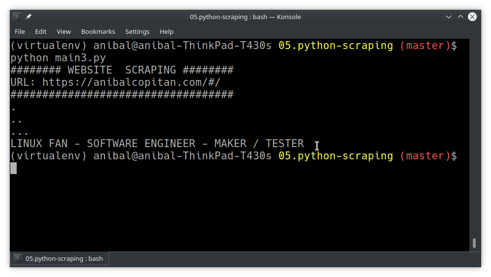

# Python-scraping

Link source: [scrapingbee](https://www.scrapingbee.com/blog/selenium-python/)
Download and install in your local machine:

[Chrome download page](https://www.google.com/chrome/)
[Chrome driver binary](https://sites.google.com/a/chromium.org/chromedriver/downloads)
selenium package

Scraping with selenium package.  
Requirements: 

	google chrome (v92)
	chromedriver (v92)

	python 2.8
	pip
	virtualenv

## development

Create virtual enviroment

	virtualenv virtualenv
	source virtualenv/bin/active

## Execute scrap

	python main3.py

## image reference

